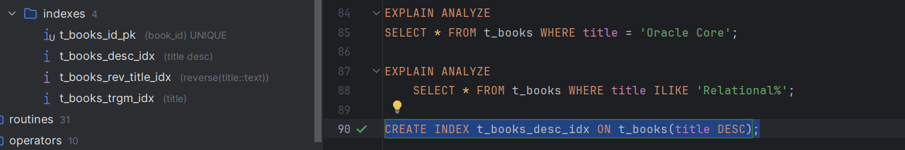

# Задание 1. B-tree индексы в PostgreSQL

1. Запустите БД через docker compose в ./src/docker-compose.yml:

Выполнение:


2. Выполните запрос для поиска книги с названием 'Oracle Core' и получите план выполнения:
   ```sql
   EXPLAIN ANALYZE
   SELECT * FROM t_books WHERE title = 'Oracle Core';
   ```
   
   *План выполнения:*

    
   
   *Объясните результат:*

    Для поиска книги у нас используется последовательное сканирование (Sequential Scan), которое проходит через
все 150000 строк нашей таблицы.

    *cost:*

    Начальная стоимость запроса 0.00

    Полная стоимость запроса после окончания сканирования 3100.00

    *rows:*

    Ожидаемое количество строк, соответствующих условию запроса 1

    *actual time=12.868..12.871:

    Реальное время выполнения запроса (сколько заняло сканирование, чтобы найти нужную строку)

    *Filter:*

    Применённое условие ((title)::text = 'Oracle Core'::text), которое проверяется для каждой строки.

    *Rows Removed by Filter: 149999:*

    Количество строк, которые не подошли под условие

    *Planning Time:*

    Время составления плана выполнения запроса (0.214 ms)

    *Execution Time:*

    Полное время выполнения запроса (12.899 ms)

3. Создайте B-tree индексы:
   ```sql
   CREATE INDEX t_books_title_idx ON t_books(title);
   CREATE INDEX t_books_active_idx ON t_books(is_active);
   ```
   
   *Результат:*
   

4. Проверьте информацию о созданных индексах:
   ```sql
   SELECT schemaname, tablename, indexname, indexdef
   FROM pg_catalog.pg_indexes
   WHERE tablename = 't_books';
   ```
   
   *Результат:*
   
   
   *Объясните результат:*
   Запрос вывел нам список созданных B-Tree индексов.
    t_books_id_pk: уникальный индекс на столбце book_id.
    t_books_title_idx: индекс для ускорения поиска по столбцу title.
    t_books_active_idx: индекс для ускорения запросов, в которых проверяется значение столбца is_active

5. Обновите статистику таблицы:
   ```sql
   ANALYZE t_books;
   ```
   
   *Результат:*
   

6. Выполните запрос для поиска книги 'Oracle Core' и получите план выполнения:
   ```sql
   EXPLAIN ANALYZE
   SELECT * FROM t_books WHERE title = 'Oracle Core';
   ```
   
   *План выполнения:*
   
   
   *Объясните результат:*
   Теперь у нас Index Scan по t_books_title_idx

    *cost:*

    Начальная стоимость запроса 0.42

    Полная стоимость запроса после окончания сканирования 8.44

    *rows:*

    Ожидаемое количество строк, соответствующих условию запроса 1

    *actual time=1.193..1.196:

    Реальное время выполнения запроса (сколько заняло сканирование, чтобы найти нужную строку)

    *Index Cond:*

    Применённое условие к индексу ((title)::text = 'Oracle Core'::text) для поиска строки.

    *Planning Time:*

    Время составления плана выполнения запроса (5.294 ms)

    *Execution Time:*

    Полное время выполнения запроса (1.214 ms)

    *Сравнение:*

    При использовании индексов у нас в разы понизилась цена запроса и время его выполнения.

7. Выполните запрос для поиска книги по book_id и получите план выполнения:
   ```sql
   EXPLAIN ANALYZE
   SELECT * FROM t_books WHERE book_id = 18;
   ```
   
   *План выполнения:*
   
   
   *Объясните результат:*
   Выполнилось индексное сканирование для поиска книги по t_books_id_pk для поиска книги
с book_id = 18

    *cost:*

    Начальная стоимость запроса 0.42

    Полная стоимость запроса после окончания сканирования 8.44

    *rows:*

    Ожидаемое количество строк, соответствующих условию запроса 1

    *actual time=2.737..2.740:

    Реальное время выполнения запроса (сколько заняло сканирование, чтобы найти нужную строку)

    *Index Cond:*

    Применённое условие к индексу (book_id = 18) для поиска строки.

    *Planning Time:*

    Время составления плана выполнения запроса (0.100 ms)

    *Execution Time:*

    Полное время выполнения запроса (2.757 ms)

    *Сравнение:*

    По book_id поиск с помощью индексов получился чуть дольше, но составление плана выполнение заняло в разы меньше времени.

8. Выполните запрос для поиска активных книг и получите план выполнения:
   ```sql
   EXPLAIN ANALYZE
   SELECT * FROM t_books WHERE is_active = true;
   ```
   
   *План выполнения:*
   
   
   *Объясните результат:*
   PostgreSQL выбрал последовательное сканирование, потому что запрос возвращает большое количество строк.

    *cost:*

    Начальная стоимость запроса 0.00

    Полная стоимость запроса после окончания сканирования 2725.00

    *rows:*

    Ожидаемое количество строк, соответствующих условию запроса 74290

    *actual time=0.006..13.841:

    Реальное время выполнения запроса (сколько заняло сканирование, чтобы найти нужную строку)

    *Filter:*

    Применённое условие is_active = true, которое проверяется для каждой строки.

    *Rows Removed by Filter: 75040:*

    Количество строк, которые не подошли под условие.

    *Planning Time:*

    Время составления плана выполнения запроса (0.071 ms)

    *Execution Time:*

    Полное время выполнения запроса (15.230 ms)

    *Объснение:*
    
    В отличие от запросов по book_id и title, несмотря на наличие индекса t_books_active_idx,
    сканирование было последовательным из-за большого количества возвращаемых строк и всего двух
    значениях true или false в столбце is_active.

9. Посчитайте количество строк и уникальных значений:
   ```sql
   SELECT 
       COUNT(*) as total_rows,
       COUNT(DISTINCT title) as unique_titles,
       COUNT(DISTINCT category) as unique_categories,
       COUNT(DISTINCT author) as unique_authors
   FROM t_books;
   ```
   
   *Результат:*
   

10. Удалите созданные индексы:
    ```sql
    DROP INDEX t_books_title_idx;
    DROP INDEX t_books_active_idx;
    ```
    
    *Результат:*
    

11. Основываясь на предыдущих результатах, создайте индексы для оптимизации следующих запросов:
    a. `WHERE title = $1 AND category = $2`
    b. `WHERE title = $1`
    c. `WHERE category = $1 AND author = $2`
    d. `WHERE author = $1 AND book_id = $2`
    
    *Созданные индексы:*

    CREATE INDEX t_books_title_category_idx ON t_books(title, category);
    
    CREATE INDEX t_books_title_idx ON t_books(title);

    CREATE INDEX t_books_category_author_idx ON t_books(category, author);

    CREATE INDEX t_books_author_book_id_idx ON t_books(author, book_id);

    

    *Объясните ваше решение:*

---
    a. Составной индекс по title и category позволяет эффективно искать строки, соответствующие обоим условиям.

    b. Индекс по title позволит эффективно обрабатывать запросы, где условие касается только title, без необходимости доступа ко второму столбцу (category).

    c. Составной индекс по category и author позволяет оптимизировать запросы, которые фильтруют строки сразу по обоим полям.

    d. Составной индекс по author и book_id эффективно обработает запросы, фильтрующие строки по автору и идентификатору книги.

---

12. Протестируйте созданные индексы.
    
    *Результаты тестов:*
    
    EXPLAIN ANALYZE
    
    SELECT * FROM t_books WHERE title = 'Oracle Core' AND category = 'Databases';

    
    
    EXPLAIN ANALYZE

    SELECT * FROM t_books WHERE title = 'Oracle Core';

    
    
    EXPLAIN ANALYZE

    SELECT * FROM t_books WHERE category = 'Databases' AND author = 'Jonathan Lewis';

    

    EXPLAIN ANALYZE
    
    SELECT * FROM t_books WHERE author = 'Jonathan Lewis' AND book_id = 18;

    

    *Объясните результаты:*
    Мы получили, что сканирование во всех случаях идет индексное и среднее время запросов
    состовляет 0,05-0,1 ms, что намного быстрее, чем все, что мы до этого делали в разы.

13. Выполните регистронезависимый поиск по началу названия:
    ```sql
    EXPLAIN ANALYZE
    SELECT * FROM t_books WHERE title ILIKE 'Relational%';
    ```
    
    *План выполнения:*

    
    
    *Объясните результат:*
    Сканирование было последовательным по причине исппользования ILIKE, так как B-Tree
    индексы чувствительны к регистру.

    *Filter:*

    Производится проверка каждой строки на наличие названия, начинающегося с 'Relational' независимо от регистра.

    *Rows Removed by Filter:*

    Ни одна строка из 150000 не подошла под условие.

    *Planning Time:*

    Время составления плана выполнения запроса (2.949 ms)

    *Execution Time:*

    Полное время выполнения запроса (55.359 ms)

    Так как у нас идет последовательная проверка всех строк и мы не используем индексы, запрос выполнялся долго.

14. Создайте функциональный индекс:
    ```sql
    CREATE INDEX t_books_up_title_idx ON t_books(UPPER(title));
    ```
    
    *Результат:*
    

15. Выполните запрос из шага 13 с использованием UPPER:
    ```sql
    EXPLAIN ANALYZE
    SELECT * FROM t_books WHERE UPPER(title) LIKE 'RELATIONAL%';
    ```
    
    *План выполнения:*
    
    
    *Объясните результат:*
    
    Произошло последовательное сканирование по причине невозможности использования B-Tree индексов
    при использовании функции UPPER(). Поэтому на выполнение запроса также ушло относительно много времени.
    
    *Filter:*

    Каждая строка проверяется на выполнение условия UPPER(title) LIKE 'RELATIONAL%'.

    Т.е. для каждой строки title применяется функция UPPER, которая приводит строку к верхнему регистру для сопоставления.

    *Rows Removed by Filter:*

    Ни одна строка из 150000 не подошла под условие.

    *Planning Time:*

    Время составления плана выполнения запроса (0.217 ms)

    *Execution Time:*

    Полное время выполнения запроса (32.723 ms)

    Запрос выполнялся достаточно долго, но быстрее, чем предыдущий в полтора раза.

    Скорее всего, это связано с приведением к верхнему регистру и уменьшение времени на проверку

    каждого символа.

16. Выполните поиск подстроки:
    ```sql
    EXPLAIN ANALYZE
    SELECT * FROM t_books WHERE title ILIKE '%Core%';
    ```
    
    *План выполнения:*
    
    
    *Объясните результат:*
    
    Производилось последовательное сканирование по причине использования ILIKE.

    *Filter:*

    Проверяется каждая строка на наличие подстроки "Core" в любом месте строки title.    

    *Rows Removed by Filter:*

    149999 строк не подошли под условие.

    *Planning Time:*

    Время составления плана выполнения запроса (0.094 ms)

    *Execution Time:*

    Полное время выполнения запроса (53.184 ms)

    Запрос выполнялся достаточно долго, по причине последовательного сканирования

    и поиска подстроки в строке.

17. Попробуйте удалить все индексы:
    ```sql
    DO $$ 
    DECLARE
        r RECORD;
    BEGIN
        FOR r IN (SELECT indexname FROM pg_indexes 
                  WHERE tablename = 't_books' 
                  AND indexname != 'books_pkey')
        LOOP
            EXECUTE 'DROP INDEX ' || r.indexname;
        END LOOP;
    END $$;
    ```
    
    *Результат:*
    
    
    *Объясните результат:*
    
    Возникла ошибка по причине того, что это нарушит целостность данных.
    
    t_books_id_pk используется как ограничение, которое гарантирует уникальность данных.

    Для того, чтобы получилось все удалить, нужно сначала удалить ограничение первичного ключа.

18. Создайте индекс для оптимизации суффиксного поиска:
    ```sql
    -- Вариант 1: с reverse()
    CREATE INDEX t_books_rev_title_idx ON t_books(reverse(title));
    
    -- Вариант 2: с триграммами
    CREATE EXTENSION IF NOT EXISTS pg_trgm;
    CREATE INDEX t_books_trgm_idx ON t_books USING gin (title gin_trgm_ops);
    ```
    
    *Результаты тестов:*
    [Вставьте планы выполнения для обоих вариантов]
    
    
    
    *Объясните результаты:*
    
    В первом варианте было произведено последовательное сканирование, так как условие
    
    требует прохода по всем строкам таблицы.
    
    Во втором варианте произошло битмапное сканирование. Созданный индекс эффективно применился

    и запрос выполнился достаточно быстро.

19. Выполните поиск по точному совпадению:
    ```sql
    EXPLAIN ANALYZE
    SELECT * FROM t_books WHERE title = 'Oracle Core';
    ```
    
    *План выполнения:*
    
    
    *Объясните результат:*
    
    Произошло битмапное сканирование с использованием индекса t_books_trgm_idx,

    который был эффективно применен.

    *Recheck Cond:*
    
    Повторная проверка соответствия условия после извлечения данных.

    *Heap Blocks:*

    exact=1 - была найдена одна запись.

    Запрос выполнился быстро по причине эффективного использования индекса

    для поиска по точному совпадению.

20. Выполните поиск по началу названия:
    ```sql
    EXPLAIN ANALYZE
    SELECT * FROM t_books WHERE title ILIKE 'Relational%';
    ```
    
    *План выполнения:*
    
    
    *Объясните результат:*
    
    Произошло битмапное сканирование с использованием индекса t_books_trgm_idx.

    Из найденных строк при Recheck Cond была удалена одна запись по причине несоответствия условию.

    Запрос выполнился достаточно быстро, индекс применился эффективно.

21. Создайте свой пример индекса с обратной сортировкой:
    ```sql
    CREATE INDEX t_books_desc_idx ON t_books(title DESC);
    ```
    

    *Тестовый запрос:*
    
    EXPLAIN ANALYZE 

    SELECT * FROM t_books WHERE title = 'Relational Database Design';
    
    *План выполнения:*
    
    
    *Объясните результат:*
    
    Было произведено индексное сканирование с использованием индекса t_books_desc_idx

    rows = 0 - не было найдено ни одной строки, соответствующей условию запроса.

    Запрос выполнился достаточно быстро, но медленнее, чем при битмапном сканировании.