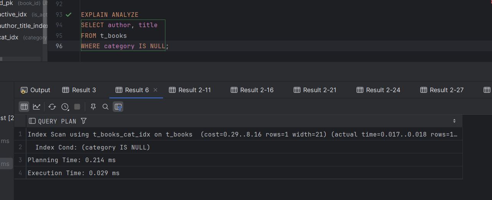

# Задание 2: Специальные случаи использования индексов

# Партиционирование и специальные случаи использования индексов

1. Удалите прошлый инстанс PostgreSQL - `docker-compose down` в папке `src` и запустите новый: `docker-compose up -d`.

2. Создайте партиционированную таблицу и заполните её данными:

    ```sql
    -- Создание партиционированной таблицы
    CREATE TABLE t_books_part (
        book_id     INTEGER      NOT NULL,
        title       VARCHAR(100) NOT NULL,
        category    VARCHAR(30),
        author      VARCHAR(100) NOT NULL,
        is_active   BOOLEAN      NOT NULL
    ) PARTITION BY RANGE (book_id);
   ```
   

    ```sql
    -- Создание партиций
    CREATE TABLE t_books_part_1 PARTITION OF t_books_part
        FOR VALUES FROM (MINVALUE) TO (50000);

    CREATE TABLE t_books_part_2 PARTITION OF t_books_part
        FOR VALUES FROM (50000) TO (100000);

    CREATE TABLE t_books_part_3 PARTITION OF t_books_part
        FOR VALUES FROM (100000) TO (MAXVALUE);
    ```
   
    ```sql
    -- Копирование данных из t_books
    INSERT INTO t_books_part 
    SELECT * FROM t_books;
    ```
    


3. Обновите статистику таблиц:
   ```sql
   ANALYZE t_books;
   ANALYZE t_books_part;
   ```
   
   *Результат:*
   

4. Выполните запрос для поиска книги с id = 18:
   ```sql
   EXPLAIN ANALYZE
   SELECT * FROM t_books_part WHERE book_id = 18;
   ```
   
   *План выполнения:*
   
   
   *Объясните результат:*

   Произошло последовательное сканирование партиции t_books_part_1 для выполнения запроса,

   т.е. просканировали все строки в этой партиции, проверяя соответствие условия book_id = 18.

   *Filter:*

    Проверка, равняется ли book_id искомому значению (18).

    *Rows Removed by Filter:*

    Из 49999 строк в таблице t_books_part_1 только одна строка соответствует условию.

    *Planning Time:*

    Время на планирование запроса 0.528 мс.

    *Execution Time:*

    Время выполнения самого запроса 2.649 мс.

    Хотя таблица партиционирована, для выполнения условия book_id = 18

    выполнилось последовательное сканирование ввиду отсутствия индексов.

    При этом PostgreSQL определил, что условие относится к диапазону значений первой партиции.

5. Выполните поиск по названию книги:
   ```sql
   EXPLAIN ANALYZE
   SELECT * FROM t_books_part 
   WHERE title = 'Expert PostgreSQL Architecture';
   ```
   
   *План выполнения:*
   
   
   *Объясните результат:*

   Был использован Append, чтобы объединить результаты сканирования всех партиций таблицы t_books_part.

    Т.к. у нас поиск по title, то сканируются все партиции.

    *Результаты фильтрации:*

    В t_books_part_1 обнаружена строка, соответствующая условию title = 'Expert PostgreSQL Architecture'.

    В t_books_part_2 и t_books_part_3 фильтр не находит подходящих строк.
   
    *Rows Removed by Filter:*

    В t_books_part_1 отфильтрованы 49,998 строк.

    В t_books_part_2 отфильтрованы 50,000 строк.

    В t_books_part_3 отфильтрованы 50,001 строк.

    *Planning time:*

    Время на планирование запроса 0.164 мс.

    *Execution Time:*

    Общее время выполнения запроса составило 9.076 мс.
    
    Было произведено последовательное сканирование всех партиций по причине отсутствия индекса для title.

6. Создайте партиционированный индекс:
   ```sql
   CREATE INDEX ON t_books_part(title);
   ```
   
   *Результат:*
   

7. Повторите запрос из шага 5:
   ```sql
   EXPLAIN ANALYZE
   SELECT * FROM t_books_part 
   WHERE title = 'Expert PostgreSQL Architecture';
   ```
   
   *План выполнения:*
   
   
   *Объясните результат:*
   
   Был использован Append, чтобы объединить результаты сканирования всех партиций.

    Было произведено индексное сканирование, так как мы создали индекс.

    *Результаты фильтрации:*

    В t_books_part_1 обнаружена строка, соответствующая условию.

    В t_books_part_2 и t_books_part_3 фильтр не находит подходящих строк,

    но фильтрация быстрее из-за использования индекса.

    *Planning time:*

    Время на планирование запроса 0.615 мс.

    *Execution Time:*

    Общее время выполнения запроса составило 0.130 мс. :
    
    t_books_part_1: 0.044–0.045 мс

    t_books_part_2: 0.036 мс
   
    t_books_part_3: 0.014–0.015 мс
    

8. Удалите созданный индекс:
   ```sql
   DROP INDEX t_books_part_title_idx;
   ```
   
   *Результат:*
   

9. Создайте индекс для каждой партиции:
   ```sql
   CREATE INDEX ON t_books_part_1(title);
   CREATE INDEX ON t_books_part_2(title);
   CREATE INDEX ON t_books_part_3(title);
   ```
   
   *Результат:*
   

10. Повторите запрос из шага 5:
    ```sql
    EXPLAIN ANALYZE
    SELECT * FROM t_books_part 
    WHERE title = 'Expert PostgreSQL Architecture';
    ```
    
    *План выполнения:*
    
    
    *Объясните результат:*

   Был использован Append, чтобы объединить результаты сканирования всех партиций.

    Было произведено индексное сканирование, так как мы создали индексы.

    *Результаты фильтрации:*

    В t_books_part_1 обнаружена строка, соответствующая условию.

    В t_books_part_2 и t_books_part_3 фильтр не находит подходящих строк,

    но фильтрация быстрее из-за использования индексов.

    *Planning time:*

    Время на планирование запроса 0.386 мс.

    *Execution Time:*

    Общее время выполнения запроса составило 0.090 мс. :
    
    t_books_part_1: 0.020 мс

    t_books_part_2: 0.026 мс
   
    t_books_part_3: 0.020 мс

    То есть при использовании индексов для каждой партиции время запроса сокращается почти в полтора раза.


11. Удалите созданные индексы:
    ```sql
    DROP INDEX t_books_part_1_title_idx;
    DROP INDEX t_books_part_2_title_idx;
    DROP INDEX t_books_part_3_title_idx;
    ```
    
    *Результат:*
    

12. Создайте обычный индекс по book_id:
    ```sql
    CREATE INDEX t_books_part_idx ON t_books_part(book_id);
    ```
    
    *Результат:*
    

    13. Выполните поиск по book_id:
        ```sql
        EXPLAIN ANALYZE
        SELECT * FROM t_books_part WHERE book_id = 11011;
        ```
    
        *План выполнения:*
        
    
        *Объясните результат:*

        Произошло индекснове сканирование по партиции t_book_part_1, так как book_id = 11011

        попадает в диапазон значений.

        Была найдена одна строка, соответствующая условию.

        Время планирования запроса 0.289 ms.

        Время выполнения запроса 0.041 ms.

        Запрос выполнился быстрее остальных по причине более эффективной индексацией числовых полей.

14. Создайте индекс по полю is_active:
    ```sql
    CREATE INDEX t_books_active_idx ON t_books(is_active);
    ```
    
    *Результат:*
    

15. Выполните поиск активных книг с отключенным последовательным сканированием:
    ```sql
    SET enable_seqscan = off;
    EXPLAIN ANALYZE
    SELECT * FROM t_books WHERE is_active = true;
    SET enable_seqscan = on;
    ```
    
    *План выполнения:*
    
    
    *Объясните результат:*
    
    Индекс t_books_active_idx использовался для быстрого поиска записей, где is_active = true.

    Сначала был создан список блоков данных с помощью индекса.

    Затем извлекались строки из этих блоков, проверяя условие.

    Так как использовался индекс, таблица просканировалась не полностью.


16. Создайте составной индекс:
    ```sql
    CREATE INDEX t_books_author_title_index ON t_books(author, title);
    ```
    
    *Результат:*
    

17. Найдите максимальное название для каждого автора:
    ```sql
    EXPLAIN ANALYZE
    SELECT author, MAX(title) 
    FROM t_books 
    GROUP BY author;
    ```
    
    *План выполнения:*
    
    
    *Объясните результат:*
    
    Данные были сгруппированы по автору и в каждой группе было найдено максимальное значение title.

    Было произведено последовательное сканирование по причине того, что индекс не помог ускорить

    выполнение с агрегатной функцией.

18. Выберите первых 10 авторов:
    ```sql
    EXPLAIN ANALYZE
    SELECT DISTINCT author 
    FROM t_books 
    ORDER BY author 
    LIMIT 10;
    ```
    
    *План выполнения:*
    
    
    *Объясните результат:*
    Сканирование по составному индексу t_books_author_title_idx.

    К таблице было всего 2 обращения (Heap fetches: 2)

    Стоимость запроса не сильно большая благодаря использованию индекса.

    Выполнился запрос достаточно быстро.

    Индекс в нашем случае очень хорошо подошел для нашего запроса, так как

    индексы подходят для извлечения уникальных значений и сортировки.

19. Выполните поиск и сортировку:
    ```sql
    EXPLAIN ANALYZE
    SELECT author, title 
    FROM t_books 
    WHERE author LIKE 'T%'
    ORDER BY author, title;
    ```
    
    *План выполнения:*
    
    
    *Объясните результат:*
    
    Произошло полное сканирование т.к. при LIKE не используется индекс.

    Под условие запроса не подошли 149999 строк.

    *Sort:*

    Отобранные строки сортируются по author и title с использованием quicksort.

    Нашлась только одна строка, которая подошла под условие.

    Запрос выполнялся достаточно долго по причине отсутствия индекса по author.

20. Добавьте новую книгу:
    ```sql
    INSERT INTO t_books (book_id, title, author, category, is_active)
    VALUES (150001, 'Cookbook', 'Mr. Hide', NULL, true);
    COMMIT;
    ```
    
    *Результат:*
    
    

21. Создайте индекс по категории:
    ```sql
    CREATE INDEX t_books_cat_idx ON t_books(category);
    ```
    
    *Результат:*
    

22. Найдите книги без категории:
    ```sql
    EXPLAIN ANALYZE
    SELECT author, title 
    FROM t_books 
    WHERE category IS NULL;
    ```
    
    *План выполнения:*
    
    
    *Объясните результат:*
    
    Произошло индексное сканирование по созданному нами t_books_cat_idx.

    Запрос нашел как раз нашу книгу без категории, которую мы добавили два шага назад.

    Ввиду использования индекса время выполнения запроса составило 0.029, т.е. очень быстро.

23. Создайте частичные индексы:
    ```sql
    DROP INDEX t_books_cat_idx;
    CREATE INDEX t_books_cat_null_idx ON t_books(category) WHERE category IS NULL;
    ```
    
    *Результат:*
    

24. Повторите запрос из шага 22:
    ```sql
    EXPLAIN ANALYZE
    SELECT author, title 
    FROM t_books 
    WHERE category IS NULL;
    ```
    
    *План выполнения:*
    
    
    *Объясните результат:*
    
    Выполнилось индексное сканирование с новым индексом t_books_cat_null_idx.

    Стоимость уменьшилась по сравнению с шагом 22 по причине меньшего объема данных,

    учитываемых в частичном индексе.

    Время выполнения одинаковое 0.029~0.030 ms., но теперь для большого объема данных

    запрос более оптимизирован.

25. Создайте частичный уникальный индекс:
    ```sql
    CREATE UNIQUE INDEX t_books_selective_unique_idx 
    ON t_books(title) 
    WHERE category = 'Science';
    
    -- Протестируйте его
    INSERT INTO t_books (book_id, title, author, category, is_active)
    VALUES (150002, 'Unique Science Book', 'Author 1', 'Science', true);
    
    -- Попробуйте вставить дубликат
    INSERT INTO t_books (book_id, title, author, category, is_active)
    VALUES (150003, 'Unique Science Book', 'Author 2', 'Science', true);
    
    -- Но можно вставить такое же название для другой категории
    INSERT INTO t_books (book_id, title, author, category, is_active)
    VALUES (150004, 'Unique Science Book', 'Author 3', 'History', true);
    ```
    
    *Результат:*
    
    Создание частичного уникального индекса:

    

    Тестирование:

    

    Вставка дубликата:

    

    Вставка для другой категории:

    
    
    *Объясните результат:*

    1. Мы создали уникальный частичный индекс t_books_selective_unique_idx, который

    работает только для строк с category = 'Science' и игнорирует остальные.

    2. У нас успешно получилось вставить, так как значение title для категории 'Science' уникально.

    3. Вставить дубликат не получилось, потому что у мы уже вставляли строку, соответствующую индексу.

    4. У нас успешно получилось вставить, так как не произошло никаких конфликтов, связанных с уникальностью.